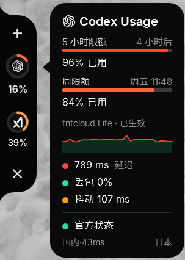
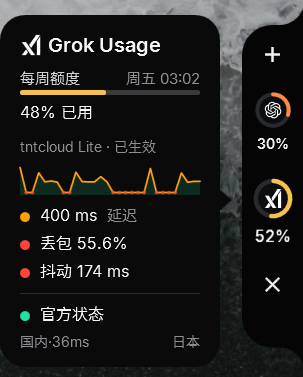
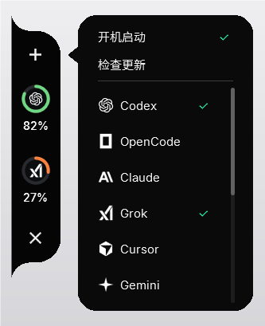
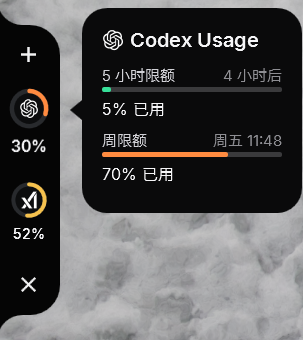
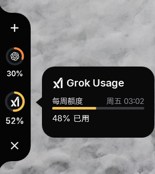
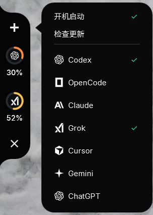
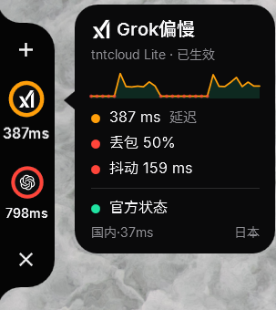
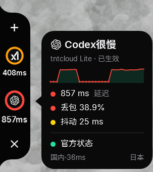
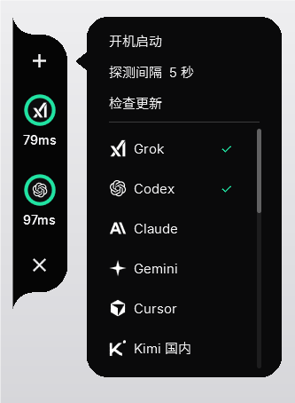

# AiDocks

Windows 屏幕边缘的 AI 监测黑舌。没有托盘，不进 Alt+Tab，闲时收成贴边的一小片；划过去展开圆环，再点开详情卡。

同一套外观，三条产品线，按需要只开一个：

| 子线 | 程序 | 做什么 |
| --- | --- | --- |
| **AI 额度 + AI 网络** | TwinDock | 额度环 + 线路延迟、丢包、官方状态 |
| **AI 额度** | QuotaDock | 只看订阅额度 |
| **AI 网络** | LineDock | 只看海外 AI 线路稳不稳 |

64 位 Windows。单文件 exe，不用装 .NET。

---

## AI 额度 + AI 网络 · TwinDock

一张卡里同时看剩余额度和当前线路。适合一直开着写代码、要顺手确认「还能用、路通不通」。

<p>



</p>

详情卡上半是额度窗口（5 小时 / 周 / 月），下半是延迟折线、丢包、抖动、官方状态灯，以及国内对照和出口节点。顶部 `+` 勾选要盯的服务商、开机启动、检查更新。

---

## AI 额度 · QuotaDock

只监测订阅额度。登录过本机 CLI / 桌面端之后会自动读，不要求再输密码。

<p>



</p>

目前可读：

- **Codex** / **ChatGPT**：本机 ChatGPT / Codex 登录
- **Grok**：`grok login` 后的本机凭据
- **Claude**：Claude Code / Claude Desktop
- **Cursor**：Cursor 桌面应用登录
- **Gemini**：Gemini CLI / Google 登录
- **OpenCode Go**：`opencode auth login` 或本机 API Key

没登录时圆环显示 `—`，不会向模型服务发生成请求，也不消耗额度。

---

## AI 网络 · LineDock

盯的是「走当前代理，连国外各大 AI 稳不稳」，不是泛泛的网速测试。延迟颜色：绿快、黄一般、橙偏慢、红很慢。

<p>



</p>

会探测 Grok、Codex、Claude、Gemini、Cursor；识别本机已生效的代理（Clash / tntcloud / 云云等，未知客户端也会扫本地端口）。详情卡给出延迟、丢包、抖动、官方状态，以及国内对照和出口地区。

---

## 怎么用

1. 从 [Releases](https://github.com/Nixz0824/AiDocks/releases) 下载对应 exe，或按下面自己编译。
2. 双击运行。贴在屏幕左或右边缘；拖黑舌可以换边、换显示器。
3. 指针靠近展开圆环；悬停或单击看详情；移开会收回。
4. 顶部 `+`：勾选服务商、开机启动、检查更新。底部 `×` 退出。
5. 第一次可能被 SmartScreen 拦截，选「仍要运行」。再开一次会关掉旧实例，只留最新这一份。

三条线可以同时开，叠在一起时把黑舌上下拖开即可。

## 自己编译

需要 [.NET 10 SDK](https://dotnet.microsoft.com/download) 和 64 位 Windows。

```powershell
dotnet publish LineDock\LineDock.csproj   -c Release -r win-x64 --self-contained true -p:PublishSingleFile=true -p:IncludeNativeLibrariesForSelfExtract=true -o dist\LineDock
dotnet publish QuotaDock\QuotaDock.csproj -c Release -r win-x64 --self-contained true -p:PublishSingleFile=true -p:IncludeNativeLibrariesForSelfExtract=true -o dist\QuotaDock
dotnet publish TwinDock\TwinDock.csproj   -c Release -r win-x64 --self-contained true -p:PublishSingleFile=true -p:IncludeNativeLibrariesForSelfExtract=true -o dist\TwinDock
```

自检：

```powershell
dotnet run --project LineDock  -- --self-test
dotnet run --project QuotaDock -- --self-test
dotnet run --project TwinDock  -- --self-test
```

## 密钥

不把 Token、OAuth secret、本机 `auth.json` 提交进仓库。额度只读各官方 CLI / 桌面端已经写在本机的登录。细节见 [SECURITY.md](SECURITY.md)。

## 数据与隐私

- 额度请求只发给签发该登录的官方接口（OpenAI / Anthropic / xAI / Cursor / Google / OpenCode），不经过第三方中转。
- 线路探测走本机系统代理或发现的本地 HTTP/SOCKS，目标是各 AI 站点与公开状态源。
- 不调用模型生成接口，不上传对话，不写遥测。
- 设置在 `%APPDATA%\<程序名>\settings.json`。额度缓存不含 Token，在 `%LOCALAPPDATA%\<程序名>\`。

额度接口不是服务商对外承诺的稳定 API，对方改返回结构后，对应圆环可能暂时读不到。

## 目录

```
AiDocks/
  LineDock/     AI 网络
  QuotaDock/    AI 额度
  TwinDock/     AI 额度 + AI 网络
  docs/screenshots/
```

更细的额度 Provider 说明见 [QuotaDock/README.md](QuotaDock/README.md)。归属见 [ATTRIBUTION.md](ATTRIBUTION.md)。

## 许可

[MIT](LICENSE)
